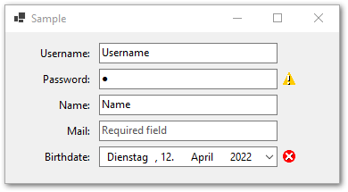

# BindingSourceValidator

Visualizes errors, warnings and missing properties for databound controls.

The BindingSourceValidator uses the ObjectValidator (or any other Validator implementing the IObjectValidator interface)
to validate the DataSource of the specified binding source. The validation will be triggered as soon, as a value 
changes. This mechanism relies only on the DataBinding.BindingComplete event.
Your data object does not need to implement INotifyPropertyChanged interface.
To avoid unneccessary validations while the user is still entering data, 
the validation calls are only executed after a certain time without any change. (*ThrottleTime*)

Errors and warnings are visualized as known by the ErrorProvider property. Missing values are visualized showing "Required field" as cue text if possible.

## Getting Started

On a user control, that already contains a BindingSource and add the **ValidationStatusProvider** and the **BindingSourceValidator** components. In the properties for the validator link it to the ValidationStatusProvider and the BindingSource and you are good to go.